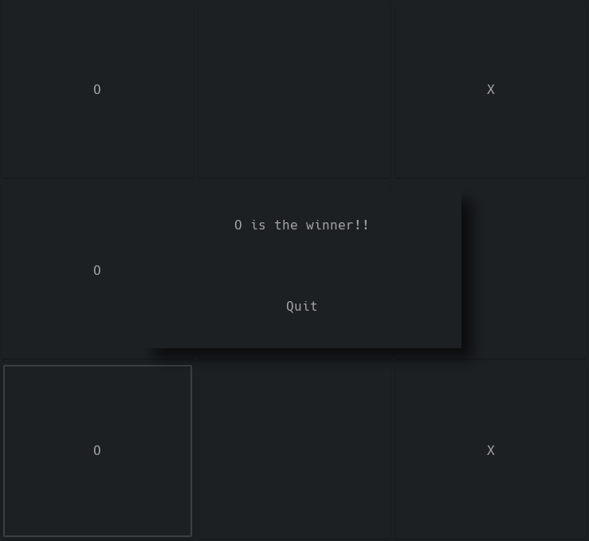

# TicTacToe



It is just a simple project made as the object of study for my learning in GTK with C language.

## Building

> Requires lib gtk3.0

Is just take this commands on a terminal:

```sh
$ cd /path/to/TicTacToe
$ make
```

This will generate a `tictactoe` file, and after is just do run:

```sh
./tictactoe
```
